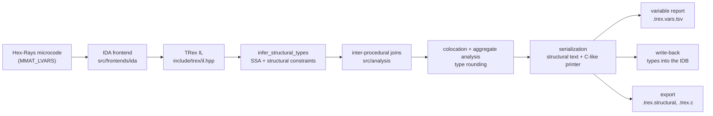

# trexida — TRex type reconstruction for IDA Pro

`trexida` recovers C types for the variables of a stripped binary and writes them back into the
IDA database. It is a C++20 port of [TRex](https://github.com/secure-foundations/trex) —
[*TRex: Practical Type Reconstruction for Binary Code*](https://www.usenix.org/conference/usenixsecurity25/presentation/bosamiya),
USENIX Security '25 — whose frontend is **Hex-Rays microcode** instead of Ghidra P-Code: IDA
decompiles a function, the plugin lifts that microcode into TRex's IL, the ported inference engine
reconstructs structural types (aggregates, pointers, integers) and the result is reported,
exported and applied to the database.

```console
$ trex_port_cli.exe from-ghidra tests/fixtures/lifted/test-linked-list-slot2.lifted \
                              tests/fixtures/lifted/test-linked-list-slot2.vars
...
// n@getlast@00100000 : t1*
// nxt@getlast@00100000 : t1*

struct t1 {
  int32_t field_0;
  t1* field_8;
};
```

Status: the port runs end to end — microcode frontend, inference core, report, file export and
write-back are implemented (port steps S0–S9), plus an inter-procedural propagation pass that the
upstream tool does not have. Correctness of the core is pinned to the Rust original by a
differential gate over the vendored upstream (see [Verification](#verification)).

## How it works



| Stage | Where | Notes |
|---|---|---|
| Lifting | `src/frontends/ida/ida_lift.cpp` | Microcode at `MMAT_LVARS` → TRex IL (`Load(Deref(IntAdd(base, const)))` is the shape the co-location analysis depends on). Every emitted instruction is validated with the ported IL validator; anything the microcode cannot express becomes an `UnderspecifiedOutputModification` fallback and is counted, with a per-reason histogram in the log. |
| Inference | `src/trex/` | Module-for-module port of upstream: SSA, reaching definitions, global value numbering, constant folding, structural types, co-location (`starts_at_analysis`), aggregate analysis, type rounding, serialization, C-like printer, `-Z` config flags. |
| Inter-procedural pass | `src/analysis/interproc.cpp` | Joins the types of variables linked by a direct call — callee parameters, returned values, arguments passed by address — aggregated across the call sites of the same callee. On by default; see [Inter-procedural propagation](#inter-procedural-propagation). |
| Write-back | `src/plugin/plugin.cpp` | Parses the printed declarations into the local TIL and sets them on the variables with `modify_user_lvar_info`, then marks the functions dirty. |

The core (`trex_core`) is IDA-free: it builds and runs without the SDK, which is what makes the
unit tests and the differential gate possible outside IDA.

## Layout

| Path | Role |
|---|---|
| `include/trex/` | Public core headers (IDA-free). One header per ported upstream module. |
| `src/trex/` | Core implementation — IL, SSA, inference, rounding, serialization, printer. |
| `src/frontends/ida/` | Hex-Rays microcode → TRex IL, plus the variable/base-type report. |
| `src/frontends/lifted/` | Parser and lifter for the Ghidra-style textual listings the tests use. |
| `src/analysis/` | Inter-procedural type propagation (extension over upstream). |
| `src/plugin/plugin.cpp` | The IDA plugin: actions, report, export, write-back. |
| `tools/port_cli.cpp` | Upstream-compatible CLI (`from-ghidra …`), used by the differential gate. |
| `tests/` | Unit tests (`harness.hpp`), fixtures, and the IDA end-to-end drivers. |
| `scripts/` | Build, syntax-check and verification scripts. |
| `third_party/trex/` | Vendored upstream Rust tree (the oracle used by the differential gate). Pinned commit in `third_party/trex/COMMIT`. |

## Requirements

| | |
|---|---|
| OS / arch | Windows x64 (MSVC ABI, `lib/x64_win_64` — `lib/x64_win_vc_64` in older SDK tags, `__EA64__`). |
| IDA | IDA Pro 9.x **with the decompiler** — without it the plugin refuses to load (`PLUGIN_SKIP`). Developed and verified against 9.4. |
| IDA SDK | A checkout of the public [HexRaysSA/ida-sdk](https://github.com/HexRaysSA/ida-sdk); the plugin builds from `v9.2` upward. Point `IDASDK` at it (the build reads `${IDASDK}/src`). |
| Compiler | Visual Studio 2022 (MSVC) or Intel oneAPI DPC++/C++ (`icx-cl`, MSVC-compatible driver). |
| Build tools | CMake ≥ 3.25, Ninja. |
| Tests | Python 3 (stdlib only) and an installed IDA (`IDADIR`) for the end-to-end stages. |
| Differential gate | A Rust toolchain — only `scripts/diff_oracle.py` needs it. |
| Optional Qt types window | A `QT_NAMESPACE=QT` Qt matching the target IDA (9.4 → Qt 6.8.2) for the dockable types window. Build it once with `cmake --build build --target build_qt` (uses the SDK's `ida-cmake/cmake/QtSupport.cmake`), or point `-DTREX_QT_ROOT=` at an existing install. Without it, the plugin still builds and works minus the window. |

The C++ core targets C++20 with exceptions enabled (`/EHsc`, the core reports invariant violations
by throwing, see `include/trex/error.hpp`) and the static CRT
(`CMAKE_MSVC_RUNTIME_LIBRARY=MultiThreaded`).

## Build

The SDK is located via the `IDASDK` environment variable (the SDK root, e.g. `E:\dev\ida-sdk-9.3`,
parent of `src/`). Set `IDADIR` to deploy the built DLL into IDA's `plugins/` directory.

```bat
set IDASDK=E:\dev\ida-sdk-9.3
set IDADIR=E:\ida pro 9.4

cmake -S . -B build -G Ninja -DCMAKE_BUILD_TYPE=Release
cmake --build build
```

The CMake script auto-resolves the SDK root to its `src/` directory. To point CMake at a layout
that does not follow the convention above, pass `-DIDA_SDK_DIR=<root>` (auto-appends `/src`) or
`-DIDA_SDK_SRC_DIR=<src>` (used verbatim). Omit `IDADIR` to build without deploying.

`scripts\build-*.bat` are thin wrappers around the same configure+build with the developer's paths
baked in:

| Script | Purpose |
|---|---|
| `scripts\build-icx.bat` | Release build with `icx-cl` — the configuration the port is developed against. |
| `scripts\build-msvc.bat` | Release build with MSVC — cross-check that isolates port bugs from compiler bugs. |
| `scripts\build-dbg.bat` | `RelWithDebInfo` build of `trex_unit_tests` only, for debugging under a debugger. |
| `scripts\check.bat <file.cpp>` | Syntax-check a single translation unit with `icx-cl` without touching a build directory. |

Targets:

| Target | What it is |
|---|---|
| `trex_core` | The IDA-free inference core. |
| `trex_interproc` | Inter-procedural propagation (links the core). |
| `trex_ref_frontend` | Ghidra-text frontend used by the CLI and the tests. |
| `trex_port_cli` | CLI mirroring upstream `from-ghidra` (deliberately does **not** link `trex_interproc`, so the differential gate exercises the untouched upstream path). |
| `trex_unit_tests` | Unit tests (IDA-free, run anywhere). |
| `trexida` | The plugin DLL. |

When `IDA_INSTALL_DIR` is set, the plugin is copied to `<IDADIR>\plugins\` after each build. A copy
in `%APPDATA%\Hex-Rays\IDA Pro\plugins` shadows `<IDADIR>\plugins` (IDA searches the user
directory first), so the build refreshes that copy too when it finds one.

Windows keeps a loaded DLL mapped until the process exits, so if an IDA instance has the plugin
loaded the deploy step fails with `Error copying file … to <IDADIR>/plugins/`. Close that instance
(or configure without `IDA_INSTALL_DIR`) and the next build copies cleanly.

## Install

1. Copy `trexida.dll` into `<IDADIR>\plugins\`, or into
   `%APPDATA%\Hex-Rays\IDA Pro\plugins\` for a single-user install.
2. Start IDA and open a database. The log line `[trexida] loaded v0.1.0 (built …)` and the
   `Edit/Plugins/TRex` submenu confirm the plugin is active.

Replacing the DLL needs a fresh IDA process: the loaded image stays mapped until the instance
exits (which is also why the post-build deploy fails while IDA holds the plugin, see
[Build](#build)).

## Use
Everything lives in the **Edit/Plugins/TRex** submenu. The same operations are reachable from
IDAPython as `ida_idaapi.load_and_run_plugin("trexida", <arg>)`, which is how the headless tests
drive them.

Clicking the plugin's own **Edit/Plugins** entry (or running `trexida` with no argument from a
script that uses `load_and_run_plugin`) opens a modal **TRex operations** chooser listing every
row below; pick one and the same body runs as if you had clicked its menu action. In `-A` batch
mode `run(0)` keeps the diagnostics-probe meaning (no chooser is available headless).
| Menu action | `run()` arg | Effect |
|---|---|---|


| Reconstruct types (current function) | `1` | Lifts and analyses the function under the cursor plus its direct callees (bounded at 32 functions). In the GUI this is also what the plugin's own entry in the plug-in list runs. |
| Reconstruct types (all functions) | `2` | Whole database, with a wait box and a working **Cancel** between functions. |
| Show last type reconstruction | `3` | Prints the variable report, the C-like types and the structural types to the message window. |
| Apply inferred types to database | `4` | Creates the inferred types in the local TIL and assigns them to the variables (see below). |
| Export last results to files | `5` | Writes `<database>.trex.structural`, `<database>.trex.c`, `<database>.trex.vars.tsv`. |
| Dump IL of current function (diagnostics) | `6` | Prints the lifted IL and the variable/base-type report, and validates every emitted instruction. |
| Probe microcode (diagnostics) | `0` | Prints the decompiler version, the maturity level each request returns and the lvars of one function. In `-A` batch mode `run(0)` keeps this meaning; in the GUI the plugin's own **Edit/Plugins** entry opens the chooser described above instead. |
| Toggle inter-procedural propagation | `7` | Flips the propagation pass for the next reconstruction. |
| Reconstruct types (current function + call tree) | `8` | Like arg `1`, but walks the function's call tree transitively (capped at 256 functions) so inter-procedural propagation reaches the deeper callees too. |
| Open types window | `9` | Opens the dockable Qt window: list of reconstructed structs, their declarations, the variables of each type, plus Copy/Apply/Rescan/Export buttons. Logs `types window: not available in this build` and exits cleanly when the plugin was built without Qt. |

### Environment variables

| Variable | Effect |
|---|---|
| `TREXIDA_OUTPUT_DIR` | Directory for the `.trex.*` outputs **and** the headless switch: no wait box, no dialogs, and the C-like result is not echoed to the message window. Used by all end-to-end tests. |
| `TREXIDA_INTERPROC` | `0` starts IDA with inter-procedural propagation off. |
| `TREXIDA_PROBE_EA` | Address (any radix, e.g. `0x140001000`) of the function the diagnostics probe analyses; otherwise the cursor, otherwise the first function. |
| `TREXIDA_OP` | Not read by the plugin: the test driver `tests/e2e/drive.py` reads it as a comma-separated list of `run()` arguments to execute in one session (e.g. `2,4` = reconstruct everything, then apply). |

### Outputs

* `<database>.trex.structural` — the `.structural` format, byte-compatible with upstream.
* `<database>.trex.c` — C-like type declarations with the variable comments the printer emits.
* `<database>.trex.vars.tsv` — one row per variable:
  `func_ea`, `func`, `variable`, `kind` (`arg`/`result`/`local`/`stack`), `width`,
  `ida_base_type` (IDA's own type) and `inferred_type` (the name the C-like output uses, or `-`).

### Inter-procedural propagation

Upstream inference is intra-procedural: a `Call*` op is `⊤`, so an argument never constrains the
callee's parameter and a returned value never constrains its caller. `src/analysis/` implements the
extension the paper sketches in §3.3 footnote 9: after structural inference, the types of the
variables linked by a call edge are joined in the program-wide container (the same join the
inference itself uses), and every later phase reads the merged container. Two call sites passing
different struct pointers through one `void*` therefore end up with the precise union of both
behaviours instead of `void*`.

* On by default; `TREXIDA_INTERPROC=0` or the toggle action switches it off.
* The pass runs between inference and the aggregate analysis and reports
  `call site(s) / argument binding(s) / return binding(s) / cross-site join(s)`.
* It lives outside `src/trex/`, so the differential gate still compares the untouched upstream
  path byte for byte.

### Notes on the write-back

The printer emits Ghidra-flavoured C, and IDA's C parser rejects parts of it. `apply` therefore:

* prefixes the declarations with the fixed-width typedefs plus IDA-visible aliases for TRex's
  `undefined1..undefined8`/`padding` (an aggregate containing one of them would otherwise fail to
  parse — observably losing every variable of that aggregate);
* computes the aggregate layout and repairs members C cannot declare: `void` members become
  exact-size padding blobs, `T[]*` becomes `T*`, a member whose size is unknown is dropped;
* leaves a variable alone (keeping IDA's own type) when the inferred type carries no information —
  `void`, `undefinedN`, `padding` — instead of storing a type that says nothing;
* rewrites types C cannot declare for a variable (incomplete array, pointer to one, a width IDA has
  no type for) into an array or byte blob of the same width, so the variable still gets a type;
* assigns the rest with `modify_user_lvar_info` and refreshes the affected functions. The message
  window reports applied/skipped counts and the reasons.

## Verification

| Gate | Command | Proves |
|---|---|---|
| Core unit tests | `build-icx\trex_unit_tests.exe` | The five inference tests transcribed from upstream `trex/src/tests.rs`, the two C-type/printer tests, and the inter-procedural module's behaviour (binding, cross-site aggregation, unresolved indirect calls, driver/plain-pipeline equality). |
| Differential gate | `python scripts\diff_oracle.py` | The port produces **byte-identical** stdout, SSA dump and `.structural` output to the Rust original, and the same node/edge set in the GraphViz dump, for every fixture in `tests/fixtures/lifted`. |
| Lift regression | `python tests\e2e\test_lift.py` | The microcode frontend's IL and variable report match the recorded golden files in `tests/e2e/golden` (re-record with `--update`). This is the only automatable coverage the microcode mapping can have without the full pipeline. |
| End-to-end | `python tests\e2e\run.py` | IDA runs headless over `fixture.exe` (built without debug info): a self-referential struct is inferred, a variable becomes a pointer to it, the report covers the database, and the C-like output carries real definitions. |
| Write-back | `python tests\e2e\test_apply.py` | A second IDA session enumerates the database's user lvar settings and finds the trex-written types. |
| Inter-procedural | `python tests\e2e\test_interproc.py` | With propagation on, `pass`, `use_a` and `use_b` share one aggregate pointer type; with `TREXIDA_INTERPROC=0` they stay per-function. |
| Everything | `python scripts\verify_all.py` | All of the above (`--skip-build` reuses the existing `build-icx` binaries). |

The end-to-end drivers need an installed IDA: they use `IDADIR` when set, otherwise the default
path baked into the scripts. The fixtures are compiled with no debug information on purpose — IDA
must see no types at all (`cl /O2 /GS-` for `fixture.c`, `/Od` for `interproc.c` so the calls
survive inlining).

`.github/workflows/ida-plugin.yml` runs the IDA-free half of this on every push: it discovers the
newest public SDK tag per minor (9.2 upward), then for each one configures and builds the plugin
with Ninja, runs the unit tests, checks the produced DLL with `dumpbin` (x64 image, imports
`ida.dll`, no dynamic CRT/Qt/Python dependency) and uploads the plugin plus the test binaries as
artifacts. The GitHub runners have no IDA and no license, so the IDA-driven stages stay local — the
workflow says so explicitly rather than faking them.

* Every SDK minor in the matrix is a hard gate — the older minors are not advisory rows, so a
  plugin that claims to build from `v9.2` upward cannot silently stop doing so, and a failure
  names the exact SDK ref it happened on. `workflow_dispatch` takes an explicit `sdk_refs`
  override for trying an unreleased or older ref.
* `-DIDA_INSTALL_DIR=""` is passed on purpose: the post-build deploy step must not trigger on a
  runner, even if `IDADIR` happens to be defined there.

## Fidelity to upstream

The port keeps upstream's structure and semantics module by module (`include/trex/*.hpp` ↔
`third_party/trex/trex/src/*.rs`), and the differential gate is the contract that keeps them
together. The deliberate differences:

| Difference | Why |
|---|---|
| IDA microcode frontend instead of the Ghidra lifter | The point of the port. The IL is upstream's (`include/trex/il.hpp`). |
| Inter-procedural propagation in `src/analysis/` | Extension described in the paper's §3.3 footnote 9; kept out of `src/trex/` and out of `trex_port_cli`. |
| `InferenceConfig` can be re-initialised | Upstream asserts the global is initialised once from the command line; the plugin runs inference repeatedly inside one IDA process. |
| The GraphViz dump's labels/escaping are rendered minimally | The differential gate compares what the file encodes (nodes, labelled edges, shapes) instead of the Rust `dot` crate's formatting; the SSA dump remains byte-compared. |
| The write-back repairs declarations for IDA's parser | IDA cannot store `void` members, unsized arrays or unknown-width types; the layout is preserved (see [Notes on the write-back](#notes-on-the-write-back)). |

## Attribution

TRex is by Jay Bosamiya (Microsoft Research), Maverick Woo and Bryan Parno (Carnegie Mellon
University), BSD 3-Clause licensed (`third_party/trex/LICENSE`); the upstream tree is vendored
under `third_party/trex/` at the commit recorded in `third_party/trex/COMMIT` and is used both as
the reference implementation and as the oracle of the differential gate. See also
[the artifact repository](https://github.com/secure-foundations/trex-usenix25).

```bibtex
@inproceedings{trex,
  author    = {Bosamiya, Jay and Woo, Maverick and Parno, Bryan},
  booktitle = {Proceedings of the USENIX Security Symposium},
  month     = {August},
  title     = {{TRex}: Practical Type Reconstruction for Binary Code},
  year      = {2025}
}
```

## License

MIT — see [LICENSE](LICENSE). That covers what this project adds: the plugin
(`src/plugin/`, `src/frontends/`, `src/analysis/`), the tools, the tests and the scripts.

Not covered by it, because the material is upstream's:

* The reconstruction engine (`include/trex/`, `src/trex/`) is a C++ port of TRex, and the vendored
  Rust tree under `third_party/trex/` is TRex itself. Both stay under TRex's BSD 3-Clause terms
  (Copyright © 2021–2025 Jay Bosamiya); the copyright notice and license text are retained in
  `third_party/trex/LICENSE`, as that license requires.
* The IDA SDK is not distributed here — the build reads it from `IDASDK`/`IDA_SDK_DIR`, and using
  it is subject to your own agreement with Hex-Rays.
